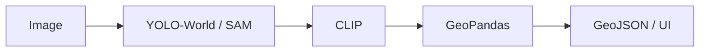

# AI Rooftop Classification for Drone Imagery

A computer-vision pipeline that processes high-resolution drone imagery to detect buildings and classify rooftops into categories such as RCC, tiled, and tin.

## Executive Overview
This repository implements an AI-assisted rooftop classification system for processing drone imagery and identifying roof construction types such as RCC, Tiled, and Tin. The solution combines zero-shot object detection, image-based classification, and geospatial export to support inspection, planning, and visualization workflows.

The system follows a practical production-ready architecture:
- Drone imagery is ingested through a Streamlit dashboard or CLI pipeline.
- A zero-shot detector identifies rooftop candidates from the image.
- Each detected rooftop is cropped and classified using a CLIP-style visual matching strategy with a deterministic fallback heuristic.
- Classification results are exported to GeoJSON for GIS workflows and can be reviewed directly in the web user interface.

## System Flow


## Problem Statement Mapping for TH2-PS-SA-002
TH2-PS-SA-002 focuses on AI-driven building and rooftop analysis using aerial or drone imagery. This repository addresses the requirement by providing:
- automated rooftop detection in overhead imagery,
- roof-type classification into common local categories,
- geospatial output suitable for QGIS and ArcGIS workflows,
- an accessible visualization layer for operational review.

## Repository Structure
- app.py: Streamlit dashboard entry point
- src/: core ML and GIS processing modules
- core/: prototype pipeline and supporting analysis classes
- data/: sample drone imagery and test assets
- outputs/: generated analysis artifacts and exports
- tests/: smoke-test verification for the core pipeline

## Quickstart

### GitHub Codespaces
1. Open the repository in GitHub Codespaces.
2. Ensure the devcontainer is used for the preconfigured Python environment.
3. Run:
   ```bash
   python -m venv .venv
   . .venv/bin/activate
   python -m pip install --upgrade pip
   python -m pip install -r requirements.txt
   streamlit run app.py
   ```
4. Open the forwarded Streamlit URL in the browser.

### Local GPU Environment
1. Create and activate a Python 3.12 virtual environment.
2. Install dependencies:
   ```bash
   python3.12 -m venv .venv
   . .venv/bin/activate
   python -m pip install --upgrade pip
   python -m pip install -r requirements.txt
   ```
3. Launch the dashboard:
   ```bash
   streamlit run app.py
   ```
4. Upload a drone image or use the bundled sample for analysis.

### CLI Usage
```bash
python src/run.py --input data/sample_drone.jpg
```

## Output Workflow
The application produces:
- annotated rooftop overlays,
- categorized classification summaries,
- downloadable CSV and GeoJSON files,
- GIS-ready polygon outputs for downstream mapping workflows.

## GIS Compatibility
The exported GeoJSON is compatible with common GIS tools including:
- QGIS
- ArcGIS Pro
- GeoJSON consumers in web and spatial pipelines

## Requirements
This project is designed around Python 3.12 and headless Linux operation, with dependency installation tuned for container workspaces and Codespaces.

## License
This project is intended for research and prototyping workflows, with usage constraints defined by the owning organization or deployment environment.
